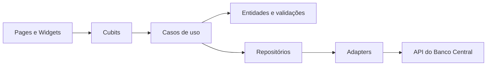

# Real Calc

Aplicativo Flutter para simular cenários financeiros de forma simples, visual e testável. O projeto reúne calculadoras de juros compostos, depósitos regulares e financiamento, além de exibir a evolução da taxa Selic a partir de dados do Banco Central do Brasil.

> Projeto em evolução: algumas rotas já estão previstas na navegação, mas ainda não possuem uma tela implementada.

## O que o projeto oferece

- Cálculo de valor futuro, taxa, prazo e valor inicial em cenários de juros compostos.
- Simulação de depósitos regulares com capitalização composta.
- Fluxo de financiamento com validação dos parâmetros informados.
- Consulta da série histórica da Selic dos últimos quatro anos.
- Indicadores com taxa anual, variação e dados para sparkline.
- Interface em Flutter com tema próprio e gerenciamento de estado por Cubit.
- Testes unitários, de widgets e de módulos.

## Tecnologias

| Tecnologia | Uso |
| --- | --- |
| Flutter/Dart | Aplicação multiplataforma |
| `flutter_bloc` | Estado e eventos da apresentação |
| `flutter_modular` | Rotas e injeção de dependências |
| `Dio` | Cliente HTTP |
| `equatable` | Comparação de estados e objetos |
| `intl` | Formatação de valores e datas |
| `shadcn_flutter` | Componentes visuais |
| `mocktail` e `bloc_test` | Testes |

## Visão rápida da arquitetura



O código é organizado por módulos de negócio dentro de `lib/modules` e por componentes compartilhados em `lib/core` e `lib/shared`. A regra de negócio não depende diretamente do Flutter ou do cliente HTTP.

## Como executar

Pré-requisitos:

- Flutter compatível com Dart `^3.10.4`.
- Um dispositivo ou emulador configurado.
- Acesso à internet para carregar a Selic.

```bash
flutter pub get
flutter run
```

Comandos úteis:

```bash
flutter analyze
flutter test
dart format lib test
```

## Estrutura principal

```text
lib/
├── core/                       # Base técnica, temas, rotas, erros e abstrações
├── modules/
│   ├── home/                   # Tela inicial e indicadores
│   ├── metrics/                # Consulta e transformação da Selic
│   └── financial_calculators/  # Cálculos, cubits e telas financeiras
├── shared/                     # Modelos compartilhados, como resposta da API
└── main.dart                   # Ponto de entrada
test/                           # Testes organizados por módulo
```

## Contribuindo

1. Crie uma branch para a alteração.
2. Mantenha a regra de negócio em casos de uso e entidades.
3. Adicione ou atualize os testes do comportamento alterado.
4. Execute `dart format`, `flutter analyze` e `flutter test`.
5. Abra um pull request descrevendo o comportamento e os cenários validados.
