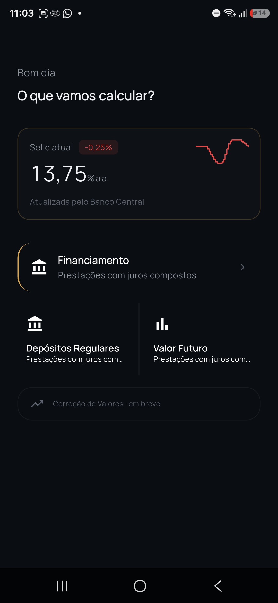
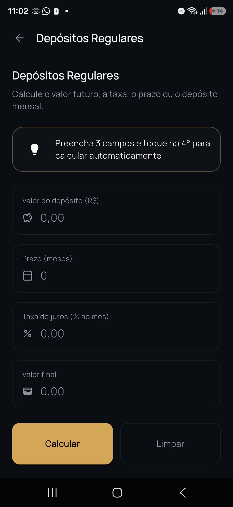
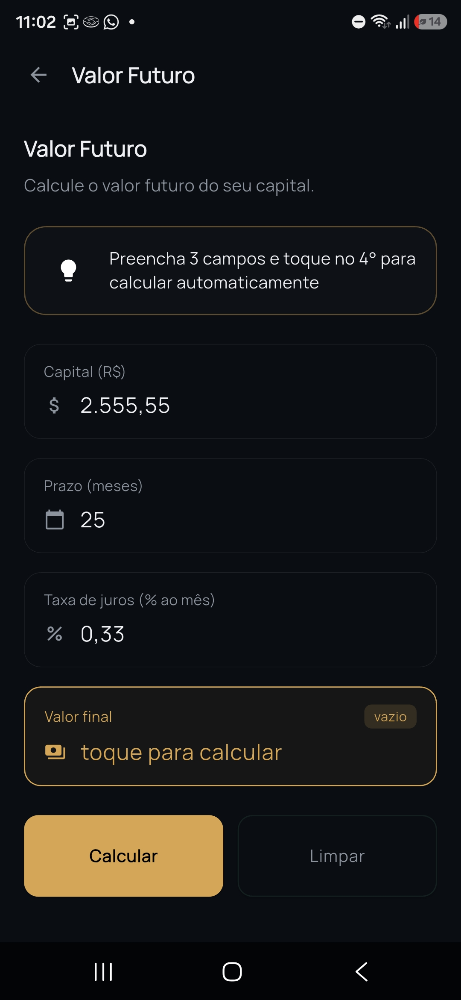
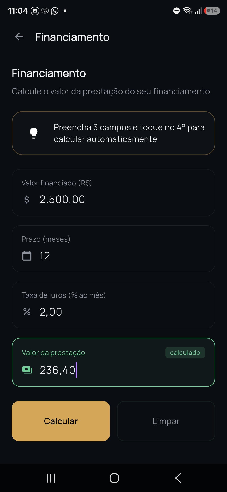
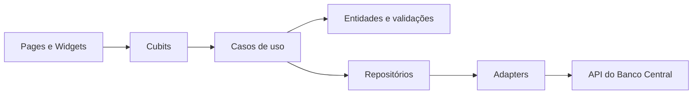

# RealCalc

<p align="center">
  
</p>

<p align="center">
  <a href="https://www.gnu.org/licenses/gpl-3.0"></a>
  <a href="https://dart.dev"></a>
  <a href="https://flutter.dev"></a>
</p>

Uma releitura moderna da **Calculadora do Cidadão**, o app oficial do Banco Central do Brasil para cálculos financeiros. O RealCalc parte da mesma lógica de cálculo (juros compostos, depósitos regulares, financiamento), mas repensa a experiência do zero — identidade visual própria, hierarquia clara entre ações, e uma solução pro problema que o app original nunca resolveu bem: em cada calculadora, qualquer um dos campos pode ser a incógnita, e a interface original não deixa isso óbvio.

> Projeto pessoal e não-oficial. Sem qualquer vínculo com o Banco Central do Brasil — construído como estudo de produto, UX e arquitetura em Flutter.
>
> Em evolução: algumas rotas já estão previstas na navegação, mas ainda não possuem uma tela implementada.

## O problema que o projeto resolve

Num formulário de financiamento, por exemplo, o usuário pode preencher valor, prazo e taxa pra descobrir a prestação — ou preencher valor, prazo e prestação pra descobrir a taxa. **Qualquer um dos 4 campos pode ser o resultado**, dependendo de qual a pessoa deixa vazio. A Calculadora do Cidadão não sinaliza isso visualmente: todos os campos parecem iguais, e a pessoa só descobre qual foi calculado depois de já ter preenchido tudo.

O RealCalc resolve isso com **estado visual por campo**, não só por tela:
- **Vazio e é o único vazio** → destaque âmbar, sinalizando "essa é a incógnita".
- **Calculado** → destaque verde, mostrando exatamente qual campo o app resolveu.
- **2 ou mais campos vazios ao mesmo tempo** → destaque vermelho + aviso, porque não dá pra saber qual calcular.
- **Preenchido normalmente** → neutro, sem competir visualmente com os outros dois estados.

Essa lógica vive num Cubit dedicado por calculadora, reagindo em tempo real a cada mudança de texto — não é um estado fixo de tela, é recalculado a cada tecla.

## O que o app oferece

- Cálculo de valor futuro, taxa, prazo e valor inicial em cenários de juros compostos.
- Simulação de depósitos regulares com capitalização composta.
- Fluxo de financiamento com os 4 estados de campo descritos acima.
- Card de métrica com a taxa Selic atual, variação desde o último ajuste do Copom e uma sparkline de tendência — com estados de carregamento e offline (mostra o último valor salvo, ou um estado de "tentar novamente").
- Interface com design system próprio: paleta de cores, tipografia e componentes centralizados via `ThemeExtension`, sem cor ou estilo hardcoded espalhado pelos widgets.
- Testes unitários, de widgets e de módulos (incluindo a fiação de injeção de dependência do `flutter_modular`).

<p float="left" align="center">
  
  
  
  
</p>

## Tecnologias

| Tecnologia | Uso |
| --- | --- |
| Flutter/Dart | Aplicação multiplataforma |
| `flutter_bloc` | Estado e eventos da apresentação |
| `flutter_modular` | Rotas e injeção de dependências |
| `Dio` | Cliente HTTP |
| `equatable` | Comparação de estados e objetos |
| `intl` | Formatação de valores e datas |
| `google_fonts` | Tipografia (Manrope) |
| `mocktail` e `bloc_test` | Testes |

**API de terceiros:** [API do Banco Central do Brasil](https://dadosabertos.bcb.gov.br/), usada como fonte de dados da taxa Selic.

## Visão rápida da arquitetura



O código é organizado por módulos de negócio dentro de `lib/modules` e por componentes compartilhados em `lib/core` e `lib/shared`. A regra de negócio não depende diretamente do Flutter ou do cliente HTTP.

## Como executar

Pré-requisitos:

- Flutter compatível com Dart `^3.10.4`.
- Um dispositivo ou emulador configurado.
- Acesso à internet para carregar a Selic.

```bash
flutter pub get
flutter run
```

Comandos úteis:

```bash
flutter analyze
flutter test
dart format lib test
```

## Estrutura principal

```text
lib/
├── core/                       # Base técnica, temas, rotas, erros e abstrações
├── modules/
│   ├── home/                   # Tela inicial e indicadores
│   ├── metrics/                # Consulta e transformação da Selic (janela de ~90-120 dias)
│   └── financial_calculators/  # Cálculos, cubits e telas financeiras
├── shared/                     # Modelos compartilhados, como resposta da API
└── main.dart                   # Ponto de entrada
test/                           # Testes organizados por módulo
```

## Roadmap

- [ ] Correção de valores por índice (IPCA, IGP-M, poupança)
- [ ] Comparação SAC vs. Price
- [ ] Simulação de amortização extra
- [ ] Histórico de cálculos
- [ ] Modo claro

## Contribuindo

1. Crie uma branch para a alteração.
2. Mantenha a regra de negócio em casos de uso e entidades.
3. Adicione ou atualize os testes do comportamento alterado.
4. Execute `dart format`, `flutter analyze` e `flutter test`.
5. Abra um pull request descrevendo o comportamento e os cenários validados.

## Licença

Este projeto está licenciado sob a **GNU General Public License v3.0**.

```
RealCalc — Financiamento, aplicações e Selic em um só lugar
Copyright (C) 2026 Rodrigosdk

This program is free software: you can redistribute it and/or modify
it under the terms of the GNU General Public License as published by
the Free Software Foundation, either version 3 of the License, or
(at your option) any later version.

This program is distributed in the hope that it will be useful,
but WITHOUT ANY WARRANTY; without even the implied warranty of
MERCHANTABILITY or FITNESS FOR A PARTICULAR PURPOSE.  See the
GNU General Public License for more details.

You should have received a copy of the GNU General Public License
along with this program.  If not, see <https://www.gnu.org/licenses/>.
```

O texto completo da licença está no arquivo [`LICENSE`](LICENSE) deste repositório.
